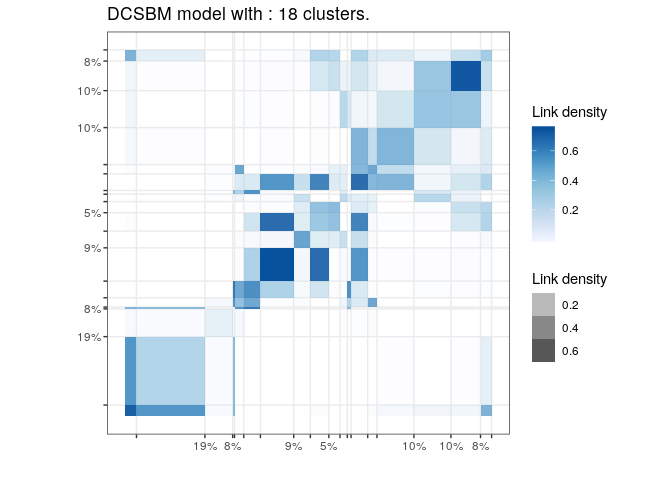
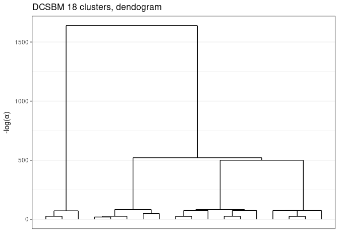
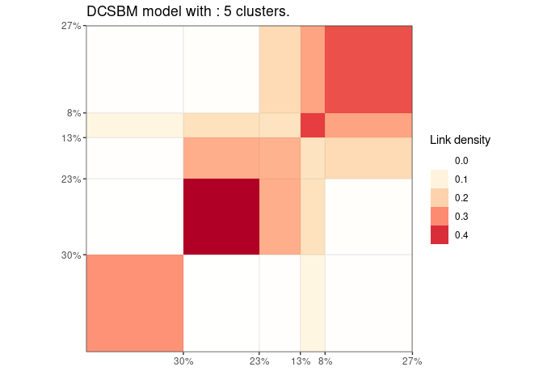
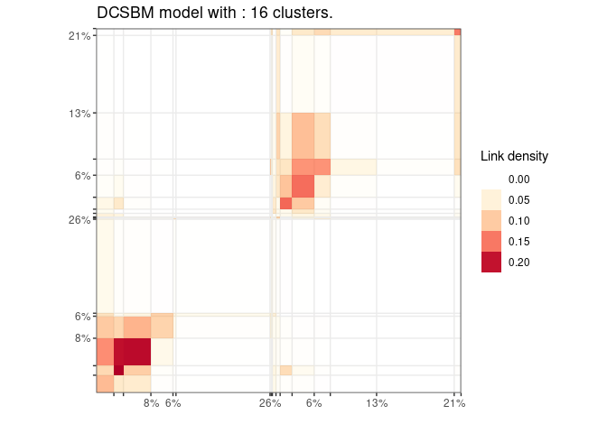

<!-- README.md is generated from README.Rmd. Please edit that file -->

# GREED : Bayesian greedy clustering 

<!-- badges: start -->

<!-- badges: end -->

Greed enable model based clustering of networks, counts data matrix and
much more with different type of generative models. Model selection and
clustering is performed in combination by optimizing the Integrated
Classification Likelihood. Details on the algorithms and methods
proposed by this package can be found in this pre-print
<https://arxiv.org/abs/2002.11577v1>.

The following generative models are available currently :

  - sbm : Stochastic Block Models (for directed and un-directed graphs),
  - dcsbm : Degree Corrected Stochastic Block Models (for directed and
    un-directed graphs),
  - co\_sbm : Latent Clock Models,
  - co\_dcsbm: Degree Corrected Latent Block Models,
  - mm: Mixture of Multinomials,
  - gmm : Gaussian Mixture Model (experimental),
  - mvmreg : Multivariate Mixture of Gaussian Regression Model
    (experimental).

With the Integrated Classification Likelihood the parameters of the
models are integrated out. Since the Integrated Classification
Likelihood introduces a natural regularization for complex models such
strategy automatically find a “natural” value for the number of cluster,
the user needs only to provide an initial guess. The optimization is
performed by default thanks to a combination of greedy local search and
a genetic algorithm, several optimization algorithms are available.

Eventually, the whole path of solutions from K\* to 1 cluster is
extracted. This enable a partial ordering of the clusters, and the
evaluation of simpler clustering. The package also provides some
plotting functionality.

## Installation

You can install the released version of greed from
[GitHub](https://github.com/) with:

``` r
install.packages("devtools")
devtools::install_github("comeetie/greed")
```

## Usage

The main function is simply the greed function. The generative model
will be chosen automatically to fit with the data provided, but you may
specify another choice with the model parameter. This is a basic example
with the classical blogs network:

``` r
library(greed)
data(Jazz)
sol=greed(Jazz)
#> ------- Fitting a dcsbm model ------
#> ################# Generation  1: best solution with an ICL of -29418 and 18 clusters #################
#> ################# Generation  2: best solution with an ICL of -29313 and 17 clusters #################
#> ################# Generation  3: best solution with an ICL of -29313 and 17 clusters #################
#> 17
```

Here Jazz is a square sparse matrix and a dcsbm model will be used by
default. Some plotting function enable the exploration of the clustering
results:

``` r
plot(sol)
```



And the hierarchical structure between clusters:

``` r
plot(sol,type='tree')
```



Eventually, one may explore some coarser clustering using the cut
function:

``` r
plot(cut(sol,5))
```



For large datasets, it’s possible to use parallelism to speed-up the
computation thanks to the future package. You only need to specify the
type of parallelism.

``` r
library(future)
plan(multisession)
data("Blogs")
sol=greed(Blogs$X)
#> ------- Fitting a dcsbm model ------
#> ################# Generation  1: best solution with an ICL of -84472 and 16 clusters #################
#> ################# Generation  2: best solution with an ICL of -84393 and 18 clusters #################
#> ################# Generation  3: best solution with an ICL of -84295 and 18 clusters #################
#> ################# Generation  4: best solution with an ICL of -84264 and 17 clusters #################
#> ################# Generation  5: best solution with an ICL of -84215 and 19 clusters #################
#> ################# Generation  6: best solution with an ICL of -84191 and 18 clusters #################
#> ################# Generation  7: best solution with an ICL of -84175 and 18 clusters #################
#> ################# Generation  8: best solution with an ICL of -84160 and 18 clusters #################
#> ################# Generation  9: best solution with an ICL of -84160 and 18 clusters #################
#> 17
plot(sol)
```


