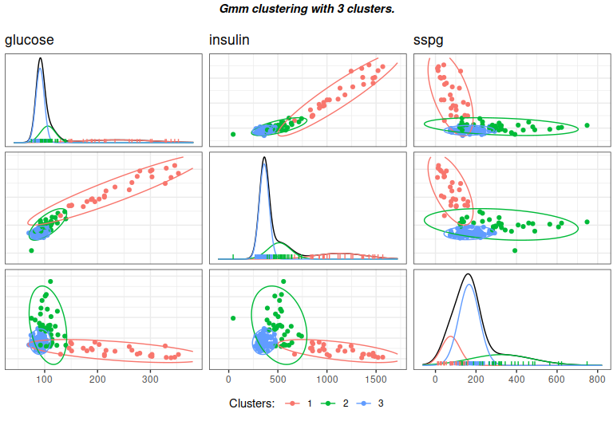
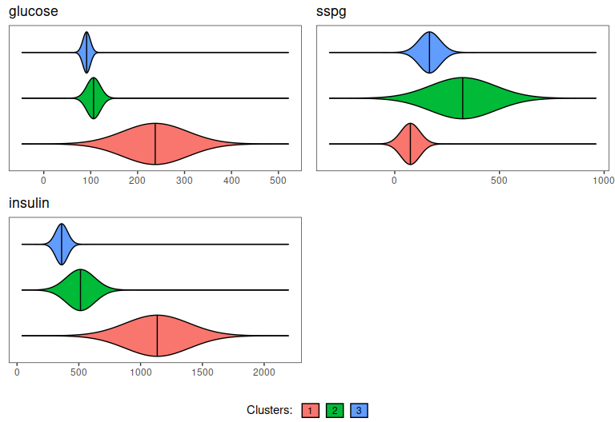
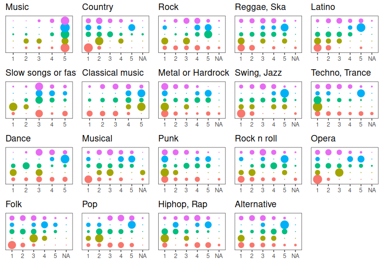
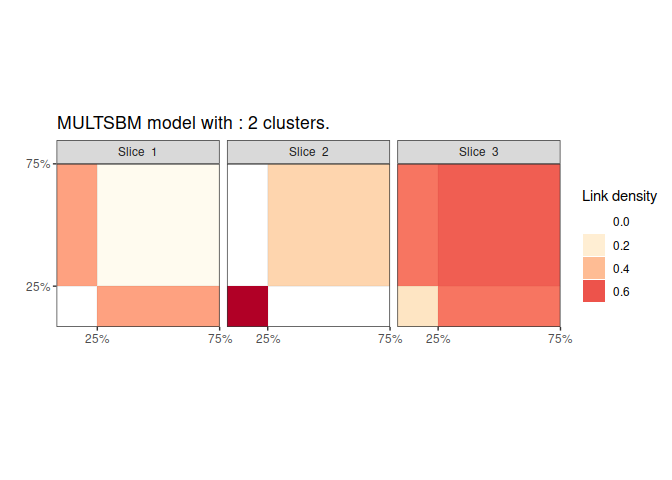

<!-- README.md is generated from README.Rmd. Please edit that file -->

# GREED : Bayesian greedy clustering

<!-- badges: start -->

[](https://github.com/comeetie/greed/actions)
[](https://CRAN.R-project.org/package=greed)
<!-- badges: end -->

Greed enables model-based clustering of networks, matrices of count data
and much more with different types of generative models. Model-selection
and clustering are performed in combination by optimizing the Integrated
Classification Likelihood. Details of the algorithms and methods
proposed by this package can be found in Côme, Jouvin, Latouche, and
Bouveyron (2021)
[10.1007/s11634-021-00440-z](https://doi.org/10.1007/s11634-021-00440-z).


Dedicated to clustering and visualization, the package is very general
and currently handles the following tasks:

-   **Continuous data clustering** with Gaussian Mixture Models. A
    tutorial is available in `vignette(GMM)`. See also the documentation
    for the `Gmm` and `DiagGmm` S4 classes.
-   **Graph data clustering** with the Stochastic Block Model or its
    degree corrected variants. A tutorial is available in
    `vignette(LCA)`. See also the documentation for the `Sbm` and
    `dcSbm` S4 classes.
-   **Categorical data clustering** with the Latent Class Analysis. A
    tutorial is available in `vignette(LCA)`. See also the documentation
    for the `Lca` S4 class.
-   **Count data clustering** with the Mixture of Multinomials model. A
    tutorial will soon be available in `vignette(MoM)`. For now, we
    refer to the documentation for the `Mom` S4 class.
-   **Mixed-typed** data clustering, *e.g.* categorical and numerical
    but the package handles virtually any type of data combination by
    stacking models on top of each data types. For example graph data
    with continuous or categorical data attached to the nodes are
    handled. A tutorial is available in `vignette(Mixed-Models)`. See
    also the documentation for the `MixedModels` S4 class.
-   **Mixture of regression** for simultaneous clustering and fitting a
    regression model in each cluster. A tutorial is available in
    `vignette(MoR)`. See also the documentation for the `MoR` S4 class.
-   **Co-clustering** of binary and count-data via the Latent Block
    Model and its degree-corrected variant. A tutorial will soon be
    available in `vignette(LBM)`. For now, we refer to the documentation
    for the `Mom` S4 class.

<!-- The following generative models are currently available:  -->
<!-- * **Stochastic Block Models** (see ``?`Sbm-class` ``), -->
<!-- * **Degree Corrected Stochastic Block Models** (see ``?`DcSbm-class` ``), -->
<!-- * **Multinomial Stochastic Block Models** (see ``?`MultSbm-class` ``), -->
<!-- * **Mixture of Multinomials** (see ``?`MoR-class` ``),  -->
<!-- * **Latent Class Analysis** (see ``?`Lca-class` ``),  -->
<!-- * **Gaussian Mixture Model** (see ``?`Gmm-class` `` and ``?`DiagGmm-class` ``), -->
<!-- * **Multivariate Mixture of Gaussian Regression Model** (see ``?`MoR-class` ``), -->
<!-- * **Degree Corrected Latent Block Model** (see ``?`DcLbm-class` ``). -->
<!-- * **Mixed Dlvm's** (see ``?`MixedModels-class` ``). -->

With the Integrated Classification Likelihood, the parameters of the
models are integrated out with a natural regularization effect for
complex models. This penalization allows to automatically find a
suitable value for the number of clusters *K*<sup>⋆</sup>. A user only
needs to provide an initial guess for the number of clusters *K*, as
well as values for the prior parameters (reasonable default values are
used if no prior information is given). The default optimization is
performed thanks to a combination of a greedy local search and a genetic
algorithm described in [Côme, Jouvin, Latouche, and Bouveyron
(2021)](https://doi.org/10.1007/s11634-021-00440-z), but several other
optimization algorithms are also available.

Eventually, a whole hierarchy of solutions from *K*<sup>⋆</sup> to 1
cluster is extracted. This enables an ordering of the clusters, and the
exploration of simpler clustering along the hierarchy. The package also
provides some plotting functionality.

## Installation

You can install the development version of greed from
[GitHub](https://github.com/) with:

``` r
#GitHub
install.packages("devtools")
devtools::install_github("comeetie/greed")
```

Or use the CRAN version:

``` r
#CRAN
install.packages("greed")
```

## Usage: the greed function

The main entry point for using the package is simply the`greed` function
(see `?greed`). The generative model will be chosen automatically to fit
the type of the provided data, but you may specify another choice with
the `model` argument.

We illustrate its use on a **graph clustering** example with the
classical Books network `?Books`.

> More use cases and their specific plotting functionality are described
> below.

``` r
library(greed)
data(Books)
sol <- greed(Books$X) 
#> 
#> ── Fitting a guess DCSBM model ──
#> 
#> ℹ Initializing a population of 20 solutions.
#> ℹ Generation 1 : best solution with an ICL of -1346 and 4 clusters.
#> ℹ Generation 2 : best solution with an ICL of -1346 and 4 clusters.
#> ── Final clustering ──
#> 
#> ── Clustering with a DCSBM model 3 clusters and an ICL of -1345
```

You may specify the model you want to use and set the priors parameters
with the (`model` argument), the optimization algorithm (`alg` argument)
and the initial number of cluster `K`. Here `Boos$X` is a square sparse
matrix and a graph clustering `` ?`DcSbm-class` `` model will be used by
default. By default, the Hybrid genetic algorithm is used.

The next example illustrates a usage without default values. A binary
`Sbm` prior is used, along with a spectral clustering algorithm for
graphs.

``` r
sol <- greed(Books$X,model=Sbm(),alg=Seed(),K=10)
#> 
#> ── Fitting a guess SBM model ──
#> 
#> ── Final clustering ──
#> 
#> ── Clustering with a SBM model 5 clusters and an ICL of -1316
```

## Visualization

Many plotting functions are available for exploring the clustering
results, and all are accessible via the `plot()` S4 method. By default,
the hierarchical structure found between clusters is returned, as a
dendrogram:

``` r
plot(sol)
```


However, depending of the specified `model`, a `type` argument may be
specified. Here, with our graph clustering model, a summary
representation of the adjacency matrix can be obtained via

``` r
plot(sol,type='blocks')
```

 \#\# Inspecting the
results

The resulting partition may be extracted with the `?clustering` method,
as well as the final ICL value with `?ICL`. You may also extract a
Maximum a Posteriori (MAP) estimation of the model parameters
(conditionally to the estimated clustering) with the `?coef` method.

``` r
table(clustering(sol))
#> 
#>  1  2  3  4  5 
#> 30 23 11 28 13
ICL(sol)
#> [1] -1315.899
coef(sol)
#> $pi
#> [1] 0.2857143 0.2190476 0.1047619 0.2666667 0.1238095
#> 
#> $thetakl
#>             [,1]       [,2]        [,3]        [,4]       [,5]
#> [1,] 0.310344828 0.06521739 0.009090909 0.000000000 0.00000000
#> [2,] 0.065217391 0.13043478 0.019762846 0.010869565 0.01337793
#> [3,] 0.009090909 0.01976285 0.436363636 0.006493506 0.04895105
#> [4,] 0.000000000 0.01086957 0.006493506 0.084656085 0.27747253
#> [5,] 0.000000000 0.01337793 0.048951049 0.277472527 0.55128205
```

Eventually, one may explore some coarser partitions using the `cut`
method:

``` r
sol_K3 = cut(sol, 3)
plot(sol_K3)
```


## Using parallel computing

For large datasets, it is possible to use parallelism to speed-up the
computations thanks to the
[future](https://github.com/HenrikBengtsson/future) package. You only
need to specify the type of back-end you want to use, before calling the
`?greed` function:

``` r
library(future)
plan(multisession, workers=2) # may be increased
```

# Typical use cases

Alongside with the previous graph clustering example below, we give a
preview of other use cases and plotting functionalities that are
model-dependent.

## Continuous data clustering with GMM

Here, we use the diabetes dataset of `mclust`. `X_cont` is a 145 × 3
design matrix, and a full-covariance `Gmm` model is specified as a model
prior.

``` r
data("diabetes", package = "mclust")
X_cont = diabetes[,-1]
sol_cont <- greed(X = X_cont, model=Gmm())
#> 
#> ── Fitting a GMM model ──
#> 
#> ℹ Initializing a population of 20 solutions.
#> ℹ Generation 1 : best solution with an ICL of -2413 and 6 clusters.
#> ℹ Generation 2 : best solution with an ICL of -2411 and 6 clusters.
#> ℹ Generation 3 : best solution with an ICL of -2401 and 3 clusters.
#> ℹ Generation 4 : best solution with an ICL of -2401 and 3 clusters.
#> ── Final clustering ──
#> 
#> ── Clustering with a GMM model 3 clusters and an ICL of -2401
table(diabetes$cl,clustering(sol_cont))
#>           
#>             1  2  3
#>   Chemical  0 25 11
#>   Normal    0  3 73
#>   Overt    27  6  0
```

Specific plots are available for this type of models

-   Pairs plots

``` r
gmmpairs(sol_cont, X_cont)
```



-   Violins plots

``` r
plot(sol_cont, type='violins')
```



> See the `vignette("GMM")` for an in-depth tutorial.

### Categorical data clustering with latent class analysis

Categorical data are typically found in

-   Item response theory  
-   Questionnaires

As an illustrative example, we use an extraction from the
`?Youngpeoplesurvey` questionaire data, where each variable is an answer
to “On a scale of 1 to 5 (NA allowed), how do you like musical genre
\[X\]”, for 19 musical genres \[X\]. Next table shows a quick glimpse at
the data.

``` r
data("Youngpeoplesurvey")
```

    #> # A tibble: 6 x 7
    #>   `Slow songs or fast songs` Dance Folk  Country `Classical music` Musical Pop  
    #>   <fct>                      <fct> <fct> <fct>   <fct>             <fct>   <fct>
    #> 1 5                          3     2     1       2                 4       3    
    #> 2 3                          2     2     2       4                 3       3    
    #> 3 5                          3     2     2       4                 3       5    
    #> 4 3                          3     2     1       4                 3       4    
    #> 5 5                          3     3     4       4                 4       4    
    #> 6 4                          4     3     1       5                 3       5

Plot the frequency of each modality inside each cluster for all
categorical variables. The size of the point represents the frequency,
the bigger the point, the larger the frequency.

``` r
sol=greed(X)
#> 
#> ── Fitting a LCA model ──
#> 
#> ℹ Initializing a population of 20 solutions.
#> ℹ Generation 1 : best solution with an ICL of -5766 and 5 clusters.
#> ℹ Generation 2 : best solution with an ICL of -5740 and 6 clusters.
#> ℹ Generation 3 : best solution with an ICL of -5740 and 6 clusters.
#> ── Final clustering ──
#> 
#> ── Clustering with a LCA model 5 clusters and an ICL of -5730
plot(sol,type='marginals') 
```



> See the `vignette("LCA")` for details.

## Graph clustering, SBM like models

The SBM allows handling categorical edges for graphs encoding complex,
non-binary interaction. This is done through a multinomial SBM
implemented in the `MultSbm` S4 class. A dedicated `plot` function is
available, representing aggregated adjacency matrix for each
modality/interaction/*view*.

``` r
data("NewGuinea")
dim(NewGuinea)
#> [1] 16 16  3
sol_newguinea = greed(NewGuinea,model=MultSbm())
#> 
#> ── Fitting a guess MULTSBM model ──
#> 
#> ℹ Initializing a population of 20 solutions.
#> ℹ Generation 1 : best solution with an ICL of -125 and 2 clusters.
#> ℹ Generation 2 : best solution with an ICL of -125 and 2 clusters.
#> ── Final clustering ──
#> 
#> ── Clustering with a MULTSBM model 2 clusters and an ICL of -125
plot(sol_newguinea,type='blocks')
```



> See the `vignette("SBM")` for details.

## Mixture of Regression

> See the `vignette("MoR")` for details.

## Advanced models\`

> See the `vignette("Mixed Models")`for details.
