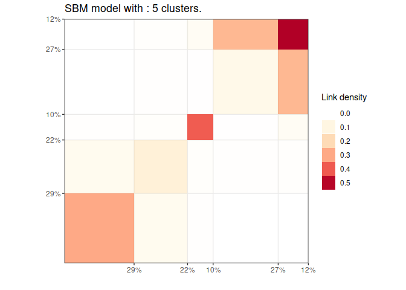

<!-- README.md is generated from README.Rmd. Please edit that file -->

# GREED : Bayesian greedy clustering 

<!-- badges: start -->

[](https://github.com/comeetie/greed/actions)
<!-- badges: end -->

Greed enables model based clustering of networks, matrices of count data
and much more with different types of generative models. Model selection
and clustering is performed in combination by optimizing the Integrated
Classification Likelihood. Details of the algorithms and methods
proposed by this package can be found in Côme, Jouvin, Latouche, and
Bouveyron (2021)
[10.1007/s11634-021-00440-z](https://doi.org/10.1007/s11634-021-00440-z).

The following generative models are available currently :

  - Stochastic Block Models (for **directed** and **un-directed**
    graphs, see `` ?`sbm-class` ``; to deal with missing values see
    `` ?`misssbm-class` ``),
  - Degree Corrected Stochastic Block Models (for **directed** and
    **un-directed** graphs, see `` ?`dcsbm-class` ``),
  - Stochastic Block Models with Multinomial observations
    (**experimental**, see `` ?`multsbm-class` ``),
  - Degree Corrected Latent Block Models (see `` ?`co_dcsbm-class` ``),
  - Mixture of Multinomials (see `` ?`mm-class` ``),
  - Gaussian Mixture Model (**experimental**, see `` ?`gmm-class` ``),
  - Multivariate Mixture of Gaussian Regression Model (**experimental**,
    see `` ?`mvmreg-class` ``).

With the Integrated Classification Likelihood, the parameters of the
models are integrated out. This allows a natural regularization for
complex models. Since the Integrated Classification Likelihood penalizes
complex models it allows to automatically find a “natural” value for the
number of clusters \(K^*\), the user only needs to provide an initial
guess as well as values for the prior parameters (sensible default
values are used if no prior information is available). The optimization
is performed by default thanks to a combination of a greedy local search
and a genetic algorithm. Several optimization algorithms are available.

Eventually, the whole path of solutions from \(K^*\) to 1 cluster is
extracted. This enables a partial ordering of the clusters, and the
evaluation of simpler clustering. The package also provides some
plotting functionality.

## Installation

You can install the released version of greed from
[GitHub](https://github.com/) with:

``` r
install.packages("devtools")
devtools::install_github("comeetie/greed")
```

## Usage

The main entry point for using the package is simply the greed function
(`?greed`). The generative model will be chosen automatically to fit
with the data provided, but you may specify another choice with the
model parameter. This is a basic example with the classical Jazz
network:

``` r
library(greed)
data(Jazz)
sol=greed(Jazz)
#> ------- undirected DCSBM model fitting ------
#> ################# Generation  1: best solution with an ICL of -28629 and 17 clusters #################
#> ################# Generation  2: best solution with an ICL of -28586 and 14 clusters #################
#> ################# Generation  3: best solution with an ICL of -28583 and 13 clusters #################
#> ################# Generation  4: best solution with an ICL of -28578 and 13 clusters #################
#> ################# Generation  5: best solution with an ICL of -28573 and 12 clusters #################
#> ################# Generation  6: best solution with an ICL of -28573 and 12 clusters #################
#> ################# Generation  7: best solution with an ICL of -28571 and 13 clusters #################
#> ################# Generation  8: best solution with an ICL of -28569 and 12 clusters #################
#> ################# Generation  9: best solution with an ICL of -28569 and 12 clusters #################
#> ------- Final clustering -------
#> ICL clustering with a DCSBM model, 11 clusters and an icl of -28564.
```

Here Jazz is a square sparse matrix and a `` ?`dcsbm-class` `` model
will be used by default. Some plotting function enable the exploration
of the clustering results:

``` r
plot(sol)
```


And the hierarchical structure between clusters:

``` r
plot(sol,type='tree')
```



Eventually, one may explore some coarser clustering using the cut
function:

``` r
plot(cut(sol,5))
```


For large datasets, it is possible to use parallelism to speed-up the
computation thanks to the
[future](https://github.com/HenrikBengtsson/future) package. You only
need to specify the type of backend you want to use.

``` r
library(future)
plan(multisession)
data("Blogs")
sol=greed(Blogs$X)
#> ------- directed DCSBM model fitting ------
#> ################# Generation  1: best solution with an ICL of -84492 and 17 clusters #################
#> ################# Generation  2: best solution with an ICL of -84301 and 18 clusters #################
#> ################# Generation  3: best solution with an ICL of -84275 and 18 clusters #################
#> ################# Generation  4: best solution with an ICL of -84210 and 17 clusters #################
#> ################# Generation  5: best solution with an ICL of -84160 and 17 clusters #################
#> ################# Generation  6: best solution with an ICL of -84152 and 20 clusters #################
#> ################# Generation  7: best solution with an ICL of -84121 and 18 clusters #################
#> ################# Generation  8: best solution with an ICL of -84117 and 18 clusters #################
#> ################# Generation  9: best solution with an ICL of -84102 and 17 clusters #################
#> ################# Generation 10: best solution with an ICL of -84102 and 17 clusters #################
#> ------- Final clustering -------
#> ICL clustering with a DCSBM model, 16 clusters and an icl of -84086.
plot(sol)
```


