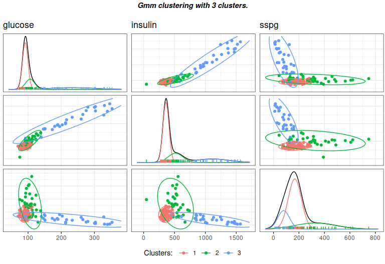

<!-- README.md is generated from README.Rmd. Please edit that file -->

# GREED : Bayesian greedy clustering

<!-- badges: start -->

[](https://github.com/comeetie/greed/actions)
[](https://CRAN.R-project.org/package=greed)
<!-- badges: end -->

Greed enables model-based clustering of networks, matrices of count data
and much more with different types of generative models. Model-selection
and clustering are performed in combination by optimizing the Integrated
Classification Likelihood. Details of the algorithms and methods
proposed by this package can be found in Côme, Jouvin, Latouche, and
Bouveyron (2021)
[10.1007/s11634-021-00440-z](https://doi.org/10.1007/s11634-021-00440-z).


Dedicated to clustering and visualization, the package is very general
and currently handles the following tasks:

-   **Continuous data clustering** with Gaussian Mixture Models. A
    tutorial is available in `vignette(GMM)`. See also the documentation
    for the `Gmm` and `DiagGmm` S4 classes.
-   **Categorical data clustering** with the Latent Class Analysis. A
    tutorial is available in `vignette(LCA)`. See also the documentation
    for the `Lca` S4 class.
-   **Graph data clustering** with the Stochastic Block Model or its
    degree corrected variants. A tutorial is available in
    `vignette(LCA)`. See also the documentation for the `Sbm` and
    `dcSbm` S4 classes.
-   **Count data clustering** with the Mixture of Multinomials model. A
    tutorial will soon be available in `vignette(MoM)`. For now, we
    refer to the documentation for the `Mom` S4 class.
-   **Mixed-typed** data clustering, *e.g.* categorical and numerical
    but the package handles virtually any type of data combination by
    stacking models on top of each data types. For example graph data
    with continuous or categorical data attached to the nodes are
    handled. A tutorial is available in `vignette(Mixed-Models)`. See
    also the documentation for the `MixedModels` S4 class.
-   **Mixture of regression** for simultaneous clustering and fitting a
    regression model in each cluster. A tutorial is available in
    `vignette(MoR)`. See also the documentation for the `MoR` S4 class.
-   **Co-clustering** of binary and count-data via the Latent Block
    Model and its degree-corrected variant. A tutorial will soon be
    available in `vignette(LBM)`. For now, we refer to the documentation
    for the `Mom` S4 class.

<!-- The following generative models are currently available:  -->
<!-- * **Stochastic Block Models** (see ``?`Sbm-class` ``), -->
<!-- * **Degree Corrected Stochastic Block Models** (see ``?`DcSbm-class` ``), -->
<!-- * **Multinomial Stochastic Block Models** (see ``?`MultSbm-class` ``), -->
<!-- * **Mixture of Multinomials** (see ``?`MoR-class` ``),  -->
<!-- * **Latent Class Analysis** (see ``?`Lca-class` ``),  -->
<!-- * **Gaussian Mixture Model** (see ``?`Gmm-class` `` and ``?`DiagGmm-class` ``), -->
<!-- * **Multivariate Mixture of Gaussian Regression Model** (see ``?`MoR-class` ``), -->
<!-- * **Degree Corrected Latent Block Model** (see ``?`DcLbm-class` ``). -->
<!-- * **Mixed Dlvm's** (see ``?`MixedModels-class` ``). -->

With the Integrated Classification Likelihood, the parameters of the
models are integrated out with a natural regularization effect for
complex models. This penalization allows to automatically find a
“natural” value for the number of clusters *K*<sup>⋆</sup>. A user only
needs to provide an initial guess for the number of clusters *K*, as
well as values for the prior parameters (reasonable default values are
used if no prior information is given). The default optimization is
performed thanks to a combination of a greedy local search and a genetic
algorithm described in [Côme, Jouvin, Latouche, and Bouveyron
(2021)](https://doi.org/10.1007/s11634-021-00440-z), but several other
optimization algorithms are also available.

Eventually, a whole hierarchy of solutions from *K*<sup>⋆</sup> to 1
cluster is extracted. This enables an ordering of the clusters, and the
exploration of simpler clustering along the hierarchy. The package also
provides some plotting functionality.

## Installation

You can install the development version of greed from
[GitHub](https://github.com/) with:

``` r
#GitHub
install.packages("devtools")
devtools::install_github("comeetie/greed")
```

Or use the CRAN version:

``` r
#CRAN
install.packages("greed")
```

## Usage

The main entry point for using the package is simply the greed function
(`?greed`). The generative model will be chosen automatically to fit
with the data provided, but you may specify another choice with the
model parameter. This is a basic example with the classical Books
network `?Books`:

``` r
library(greed)
data(Books)
sol <- greed(Books$X)
#> 
#> ── Fitting a guess DCSBM model ──
#> 
#> ℹ Initializing a population of 20 solutions.
#> ℹ Generation 1 : best solution with an ICL of -1347 and 3 clusters.
#> ℹ Generation 2 : best solution with an ICL of -1346 and 4 clusters.
#> ℹ Generation 3 : best solution with an ICL of -1346 and 4 clusters.
#> ── Final clustering ──
#> 
#> ── Clustering with a DCSBM model 3 clusters and an ICL of -1345
```

You may specify the model you want to use and set the priors parameters
with the (model argument), the optimization algorithm (alg argument) and
the initial number of cluster K. Here football is a square sparse matrix
and a graph clustering `` ?`DcSbm-class` `` model will be used by
default, and the Hybrid genetic algorithm greed used.

``` r
sol <- greed(Books$X,model=Sbm(),alg=Seed(),K=10)
#> 
#> ── Fitting a guess SBM model ──
#> 
#> ── Final clustering ──
#> 
#> ── Clustering with a SBM model 5 clusters and an ICL of -1257
```

Some plotting function enable the exploration of the clustering results,
the hierarchical structure between clusters:

``` r
plot(sol)
```


Or a summary représentation of the adjacency matrix:

``` r
plot(sol,type='blocks')
```


You may extract the model fitted parameters with the `?coef` function,
the clustering with the `?clustering` function, the value of ICL with
`?ICL`:

``` r
ICL(sol)
#> [1] -1257.103
coef(sol)
#> $pi
#> [1] 0.08571429 0.30476190 0.18095238 0.37142857 0.05714286
#> 
#> $thetakl
#>             [,1]        [,2]        [,3]        [,4]       [,5]
#> [1,] 0.722222222 0.357638889 0.058479532 0.002849003 0.00000000
#> [2,] 0.357638889 0.094758065 0.006578947 0.004006410 0.00000000
#> [3,] 0.058479532 0.006578947 0.251461988 0.016194332 0.04385965
#> [4,] 0.002849003 0.004006410 0.016194332 0.099865047 0.42735043
#> [5,] 0.000000000 0.000000000 0.043859649 0.427350427 0.73333333
table(clustering(sol))
#> 
#>  1  2  3  4  5 
#>  9 32 19 39  6
```

Eventually, one may explore some coarser clustering using the cut
function:

``` r
plot(cut(sol,3))
```


For large datasets, it is possible to use parallelism to speed-up the
computation thanks to the
[future](https://github.com/HenrikBengtsson/future) package. You only
need to specify the type of backend you want to use, before calling the
`?greed` function:

``` r
library(future)
plan(multisession)
```

## Typical use cases

### Classical clustering, GMM

See the `vignette("GMM")` for details.

``` r
data("diabetes",package = "mclust")
X <- diabetes[,-1]
sol <- greed(X,model=Gmm())
#> 
#> ── Fitting a GMM model ──
#> 
#> ℹ Initializing a population of 20 solutions.
#> ℹ Generation 1 : best solution with an ICL of -2425 and 8 clusters.
#> ℹ Generation 2 : best solution with an ICL of -2406 and 4 clusters.
#> ℹ Generation 3 : best solution with an ICL of -2400 and 4 clusters.
#> ℹ Generation 4 : best solution with an ICL of -2397 and 3 clusters.
#> ℹ Generation 5 : best solution with an ICL of -2396 and 4 clusters.
#> ℹ Generation 6 : best solution with an ICL of -2396 and 4 clusters.
#> ── Final clustering ──
#> 
#> ── Clustering with a GMM model 3 clusters and an ICL of -2395
table(diabetes$cl,clustering(sol))
#>           
#>             1  2  3
#>   Chemical 11 24  1
#>   Normal   74  2  0
#>   Overt     0  6 27
gmmpairs(sol,X)
```



### Questionnary and item response theory datasets, LCA

See the `vignette("LCA")` for details.

### Graphs, SBM like models

See the `vignette("SBM")` for details.

### Mixture of Regression

See the `vignette("MoR")` for details.

### Advanced models\`

See the `vignette("Mixed Models")`for details.
