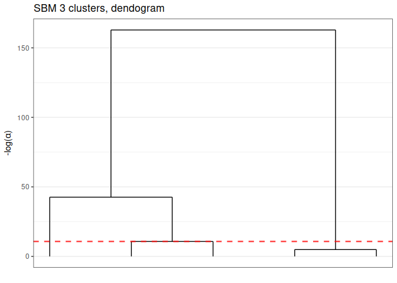

<!-- README.md is generated from README.Rmd. Please edit that file -->

# GREED : Bayesian greedy clustering

<!-- badges: start -->

[](https://github.com/comeetie/greed/actions)
[](https://CRAN.R-project.org/package=greed)
<!-- badges: end -->

Greed enables model based clustering of networks, matrices of count data
and much more with different types of generative models. Model selection
and clustering is performed in combination by optimizing the Integrated
Classification Likelihood. Details of the algorithms and methods
proposed by this package can be found in Côme, Jouvin, Latouche, and
Bouveyron (2021)
[10.1007/s11634-021-00440-z](https://doi.org/10.1007/s11634-021-00440-z).


The following generative models are available currently :

-   **Stochastic Block Models** (see `` ?`Sbm-class` ``),
-   **Degree Corrected Stochastic Block Models** (see
    `` ?`DcSbm-class` ``),
-   **Multinomial Stochastic Block Models** (see
    `` ?`MultSbm-class` ``),
-   **Mixture of Multinomials** (see `` ?`MoR-class` ``),
-   **Latent Class Analysis** (see `` ?`Lca-class` ``),
-   **Gaussian Mixture Model** (see `` ?`Gmm-class` `` and
    `` ?`DiagGmm-class` ``),
-   **Multivariate Mixture of Gaussian Regression Model** (see
    `` ?`MoR-class` ``),
-   **Degree Corrected Latent Block Model** (see `` ?`DcLbm-class` ``).
-   **Mixed Dlvm’s** (see `` ?`MixedModels-class` ``).

With the Integrated Classification Likelihood, the parameters of the
models are integrated out. This allows a natural regularization for
complex models. Since the Integrated Classification Likelihood penalizes
complex models it allows to automatically find a “natural” value for the
number of clusters *K*<sup>\*</sup>, the user only needs to provide an
initial guess as well as values for the prior parameters (sensible
default values are used if no prior information is available). The
optimization is performed by default thanks to a combination of a greedy
local search and a genetic algorithm. Several optimization algorithms
are available.

Eventually, the whole path of solutions from *K*<sup>\*</sup> to 1
cluster is extracted. This enables a partial ordering of the clusters,
and the evaluation of simpler clustering. The package also provides some
plotting functionality.

## Installation

You can install the development version of greed from
[GitHub](https://github.com/) with:

``` r
#GitHub
install.packages("devtools")
devtools::install_github("comeetie/greed")
```

Or use the CRAN version:

``` r
#CRAN
install.packages("greed")
```

## Usage

The main entry point for using the package is simply the greed function
(`?greed`). The generative model will be chosen automatically to fit
with the data provided, but you may specify another choice with the
model parameter. This is a basic example with the classical Books
network `?Books`:

``` r
library(greed)
data(Books)
sol <- greed(Books$X)
#> ------- guess DCSBM model fitting ------
#> ################# Generation  1: best solution with an ICL of -1346 and 4 clusters #################
#> ################# Generation  2: best solution with an ICL of -1346 and 4 clusters #################
#> ------- Final clustering -------
#> ICL clustering with a DCSBM model, 3 clusters and an icl of -1345.
```

You may specify the model you want to use and set the priors parameters
with the (model argument), the optimization algorithm (alg argument) and
the initial number of cluster K. Here football is a square sparse matrix
and a graph clustering `` ?`DcSbm-class` `` model will be used by
default, and the Hybrid genetic algorithm greed used.

``` r
sol <- greed(Books$X,model=Sbm(),alg=Seed(),K=10)
#> ------- guess SBM model fitting ------
#> ------- Final clustering -------
#> ICL clustering with a SBM model, 5 clusters and an icl of -1257.
```

Some plotting function enable the exploration of the clustering results,
the hierarchical structure between clusters:

``` r
plot(sol)
```


Or a summary représentation of the adjacency matrix:

``` r
plot(sol,type='blocks')
```


You may extract the model fitted parameters with the `?coef` function,
the clustering with the `?clustering` function, the value of ICL with
`?ICL`:

``` r
ICL(sol)
#> [1] -1256.988
coef(sol)
#> $pi
#> [1] 0.09523810 0.29523810 0.19047619 0.36190476 0.05714286
#> 
#> $thetakl
#>             [,1]        [,2]        [,3]        [,4]       [,5]
#> [1,] 0.711111111 0.329032258 0.060000000 0.002631579 0.00000000
#> [2,] 0.329032258 0.090322581 0.008064516 0.001697793 0.00000000
#> [3,] 0.060000000 0.008064516 0.231578947 0.019736842 0.04166667
#> [4,] 0.002631579 0.001697793 0.019736842 0.099573257 0.43859649
#> [5,] 0.000000000 0.000000000 0.041666667 0.438596491 0.73333333
table(clustering(sol))
#> 
#>  1  2  3  4  5 
#> 10 31 20 38  6
```

Eventually, one may explore some coarser clustering using the cut
function:

``` r
plot(cut(sol,3))
```



For large datasets, it is possible to use parallelism to speed-up the
computation thanks to the
[future](https://github.com/HenrikBengtsson/future) package. You only
need to specify the type of backend you want to use, before calling the
`?greed` function:

``` r
library(future)
plan(multisession)
```

## Typical use cases

### Classical clustering, GMM

See the `vignette("GMM")` for details.

``` r
data("diabetes",package = "mclust")
X <- diabetes[,-1]
sol <- greed(X,model=Gmm())
#> ------- GMM model fitting ------
#> ################# Generation  1: best solution with an ICL of -2421 and 6 clusters #################
#> ################# Generation  2: best solution with an ICL of -2416 and 5 clusters #################
#> ################# Generation  3: best solution with an ICL of -2406 and 3 clusters #################
#> ################# Generation  4: best solution with an ICL of -2396 and 3 clusters #################
#> ################# Generation  5: best solution with an ICL of -2396 and 3 clusters #################
#> ################# Generation  6: best solution with an ICL of -2396 and 3 clusters #################
#> ------- Final clustering -------
#> ICL clustering with a GMM model, 3 clusters and an icl of -2396.
table(diabetes$cl,clustering(sol))
#>           
#>             1  2  3
#>   Chemical 11 24  1
#>   Normal   73  3  0
#>   Overt     0  6 27
gmmpairs(sol,X)
```


### Questionnary and item response theory datasets, LCA

See the `vignette("LCA")` for details.

### Graphs, SBM like models

See the `vignette("SBM")` for details.

### Mixture of Regression

See the`vignette("MoR")` for details.

### Advanced models

See the `vignette("Mixed Models")`for details.
