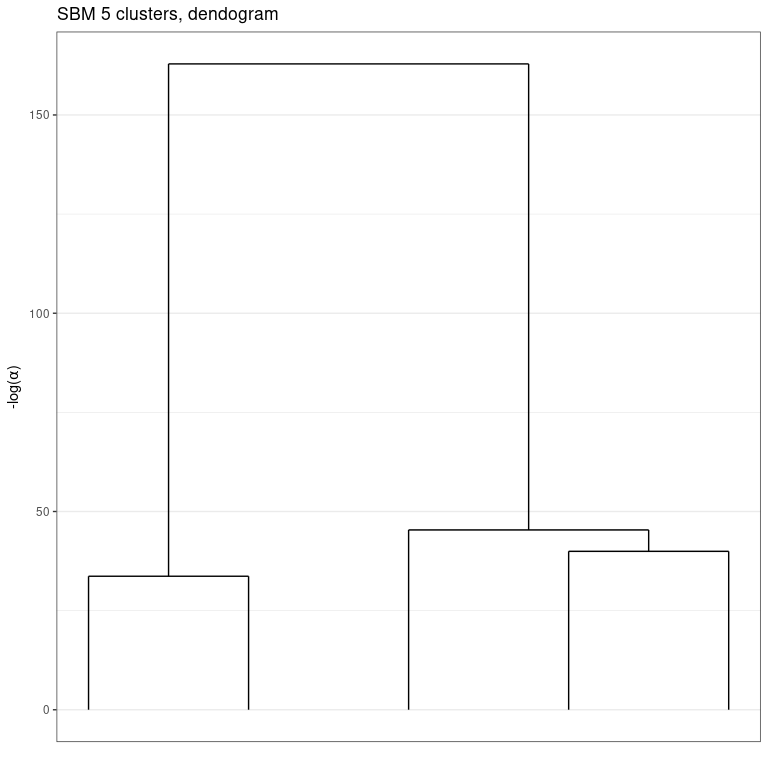
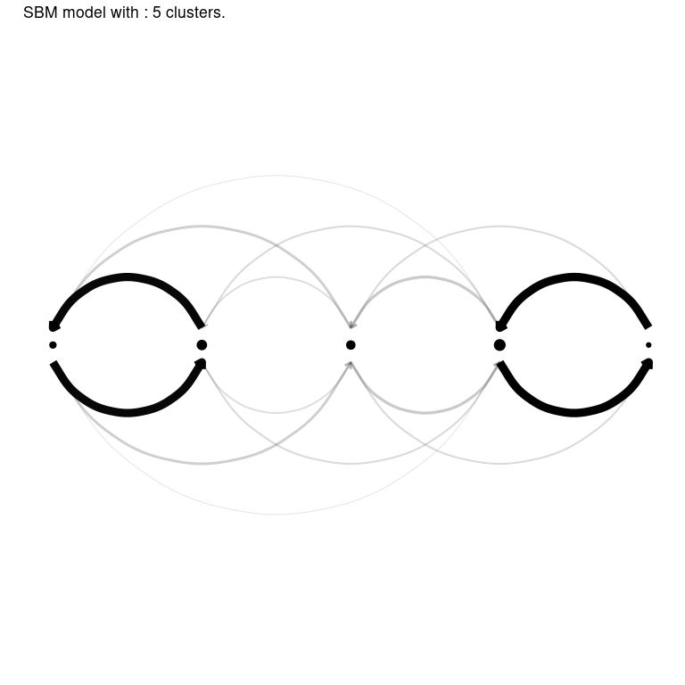

<!-- README.md is generated from README.Rmd. Please edit that file -->

# GREED : Bayesian greedy clustering

<!-- badges: start -->

[](https://github.com/comeetie/greed/actions)
[](https://CRAN.R-project.org/package=greed)
<!-- badges: end -->

Greed enables model-based clustering of networks, matrices of count data
and much more with different types of generative models. Model-selection
and clustering are performed in combination by optimizing the Integrated
Classification Likelihood. Details of the algorithms and methods
proposed by this package can be found in Côme, Jouvin, Latouche, and
Bouveyron (2021)
[10.1007/s11634-021-00440-z](https://doi.org/10.1007/s11634-021-00440-z).


Dedicated to clustering and visualization, the package is very general
and currently handles the following tasks:

-   **Continuous data clustering** with Gaussian Mixture Models. A
    [GMM](https://comeetie.github.io/greed/articles/GMM.html) tutorial
    is available. See also the documentation for the `Gmm` and `DiagGmm`
    S4 classes.
-   **Graph data clustering** with the Stochastic Block Model or its
    degree corrected variants. A
    [SBM](https://comeetie.github.io/greed/articles/SBM.html) tutorial
    is available . See also the documentation for the `Sbm` and `dcSbm`
    S4 classes.
-   **Categorical data clustering** with the Latent Class Analysis. An
    [LCA](https://comeetie.github.io/greed/articles/LCA.html) tutorial
    is available. See also the documentation for the `Lca` S4 class.
-   **Count data clustering** with the Mixture of Multinomials model. A
    tutorial will soon be available. For now, we refer to the
    documentation for the `Mom` S4 class.
-   **Mixed-typed** data clustering, *e.g.* categorical and numerical
    but the package handles virtually any type of data combination by
    stacking models on top of each data types. For example graph data
    with continuous or categorical data attached to the nodes are
    handled. A
    [CombinedModels](https://comeetie.github.io/greed/articles/CombinedModels.html)
    tutorial is available. See also the documentation for the
    `CombinedModels` S4 class.
-   **Mixture of regression** for simultaneous clustering and fitting a
    regression model in each cluster. A
    [MoR](https://comeetie.github.io/greed/articles/MoR.html) tutorial
    is available. See also the documentation for the `MoR` S4 class.
-   **Co-clustering** of binary and count-data via the Latent Block
    Model and its degree-corrected variant. A tutorial will soon be
    available. For now, we refer to the documentation for the `DcLbm` S4
    class.

With the Integrated Classification Likelihood, the parameters of the
models are integrated out with a natural regularization effect for
complex models. This penalization allows to automatically find a
suitable value for the number of clusters *K*<sup>⋆</sup>. A user only
needs to provide an initial guess for the number of clusters *K*, as
well as values for the prior parameters (reasonable default values are
used if no prior information is given). The default optimization is
performed thanks to a combination of a greedy local search and a genetic
algorithm described in [Côme, Jouvin, Latouche, and Bouveyron
(2021)](https://doi.org/10.1007/s11634-021-00440-z), but several other
optimization algorithms are also available.

Eventually, a whole hierarchy of solutions from *K*<sup>⋆</sup> to 1
cluster is extracted. This enables an ordering of the clusters, and the
exploration of simpler clustering along the hierarchy. The package also
provides some plotting functionality.

## Installation

You can install the development version of greed from
[GitHub](https://github.com/) with:

``` r
#GitHub
install.packages("devtools")
devtools::install_github("comeetie/greed")
```

Or use the CRAN version:

``` r
#CRAN
install.packages("greed")
```

## Usage: the greed function

The main entry point for using the package is simply the`greed` function
(see `?greed`). The generative model will be chosen automatically to fit
the type of the provided data, but you may specify another choice with
the `model` argument.

We illustrate its use on a **graph clustering** example with the
classical Books network `?Books`.

> More use cases and their specific plotting functionality are described
> in the vignettes.

``` r
library(greed)
data(Books)
sol <- greed(Books$X) 
#> 
#> ── Fitting a guess DCSBM model ──
#> 
#> ℹ Initializing a population of 20 solutions.
#> ℹ Generation 1 : best solution with an ICL of -1347 and 3 clusters.
#> ℹ Generation 2 : best solution with an ICL of -1346 and 4 clusters.
#> ℹ Generation 3 : best solution with an ICL of -1346 and 4 clusters.
#> ── Final clustering ──
#> 
#> ── Clustering with a DCSBM model 3 clusters and an ICL of -1345
```

You may specify the model you want to use and set the priors parameters
with the (`model` argument), the optimization algorithm (`alg` argument)
and the initial number of cluster `K`. Here `Books$X` is a square sparse
matrix and a graph clustering `` ?`DcSbm-class` `` model will be used by
default. By default, the Hybrid genetic algorithm is used.

The next example illustrates a usage without default values. A binary
`Sbm` prior is used, along with a spectral clustering algorithm for
graphs.

``` r
sol <- greed(Books$X,model=Sbm(),alg=Seed(),K=10)
#> 
#> ── Fitting a guess SBM model ──
#> 
#> ── Final clustering ──
#> 
#> ── Clustering with a SBM model 5 clusters and an ICL of -1255
```

## Result analysis

The results of `greed()` is an S4 class which depends on the `model`
argument (here, an SBM) which comes with readily implemented methods:
`clustering()` to access the estimated partitions, `K()` the estimated
number of clusters, and `coef()` the (conditional) maximum a posteriori
of the model parameters.

``` r
table(Books$label,clustering(sol)) %>% knitr::kable()
```

|     |   1 |   2 |   3 |   4 |   5 |
|:----|----:|----:|----:|----:|----:|
| c   |   0 |   1 |   6 |  36 |   6 |
| l   |   8 |  30 |   5 |   0 |   0 |
| n   |   0 |   2 |   8 |   3 |   0 |

``` r
K(sol)
#> [1] 5
coef(sol)
#> $pi
#> [1] 0.07619048 0.31428571 0.18095238 0.37142857 0.05714286
#> 
#> $thetakl
#>             [,1]        [,2]        [,3]        [,4]       [,5]
#> [1,] 0.821428571 0.367424242 0.065789474 0.003205128 0.00000000
#> [2,] 0.367424242 0.106060606 0.006379585 0.003885004 0.00000000
#> [3,] 0.065789474 0.006379585 0.251461988 0.016194332 0.04385965
#> [4,] 0.003205128 0.003885004 0.016194332 0.099865047 0.42735043
#> [5,] 0.000000000 0.000000000 0.043859649 0.427350427 0.73333333
```

## Inspecting the hierarchy

An important aspect of the **greed** package is its hierarchical
clustering algorithm which extract a set of nested partitions from
`K=K(sol)` to `K=1`. This hierarchy may be visualized thanks to a
dendogram representing the fusion order and the level of regularization
 − log (*α*) needed for each fusion.

``` r
plot(sol, type='tree') # try also: type="path"
```



Moreover, similar to standard hierarchical algorithm such as `hclust`,
the `cut()` method allows you to extract a partition at any stage of the
hierarchy. Its results is still an S4 object, and the S4 methods
introduced earlier may again be used to investigate the results.

``` r
sol_K3 = cut(sol, K=3)
K(sol_K3)
#> [1] 3
table(Books$label,clustering(sol_K3)) %>% knitr::kable()
```

|     |   1 |   2 |   3 |
|:----|----:|----:|----:|
| c   |   1 |   6 |  42 |
| l   |  38 |   5 |   0 |
| n   |   2 |   8 |   3 |

## Visualization

Finally, the **greed** package propose efficient and model-adapted
visualization via the `plot()` methods. In this graph clustering
example, the `"blocks"` and `"nodelink"` display the cluster-aggregated
adjacency matrix and diagram of the graph respectively. Note that the
ordering of the clusters is the same than the one computed for the
dendrogram, greatly enhancing visualization of the hierarchical
structure.

``` r
plot(sol,type='blocks')
plot(sol, type='nodelink')
```



## Other models

As explained above, the greed package implements many standard models
and the list may be displayed with

``` r
available_models()
```

Many plotting functions are available and, depending of the specified
`model`, different `type` argument may be specified. For further
information we refer to the vignettes linked above for each use case.

## Using parallel computing

For large datasets, it is possible to use parallelism to speed-up the
computations thanks to the
[future](https://github.com/futureverse/future) package. You only
need to specify the type of back-end you want to use, before calling the
`?greed` function:

``` r
library(future)
plan(multisession, workers=2) # may be increased
```
